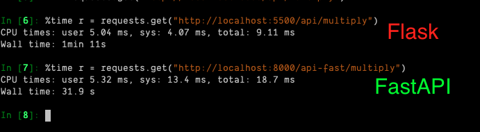

# Let's end the Flask vs FastAPI debate

In this repo we are putting up an API created in Flask against the same API created using FastAPI. Here, we aren't looking at overall efficiency of Flask vs FastAPI just how much better is one framework at making multiple API calls than the another one.

Let me give you the verdict, FastAPI is quite faster than Flask for this example. Yeah it does use more resource than Flask but here we are just talking about raw speeds.



## How to run this?

```
pip install -r requirements.txt
```

_Open Two terminals_

### Terminal 1

```
cd flask_api/
python app.py
```

### Terminal 2

```
cd fast_api/
uvicorn app:app
```

## Test It!

_Open `ipython` or a **Jupyter Notebook**_

```
import requests

# fast api

%time r = requests.get("http://localhost:8000/api-fast/multiply")

# flask

%time r = requests.get("http://localhost:5500/api/multiply")

```

Do this in two different cells and you will have your result. Check the `wall time` to observe the total elapsed time

### Bonus

If you compare the `util.py` file in both the **flask_api** and the **fast_api** folders you will observe that we end up writing very less code when creating and executing `async` functions in **FastAPI**. Let's say it's _developer friendly_ when it comes to making `async` calls and calling independent functions in parallel.
